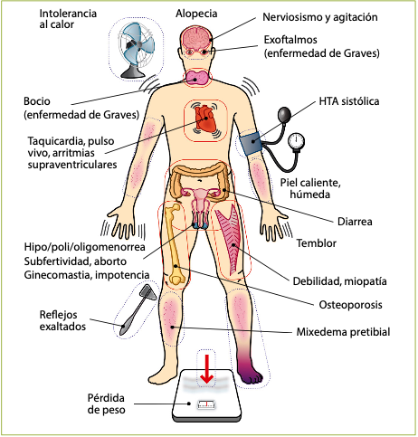
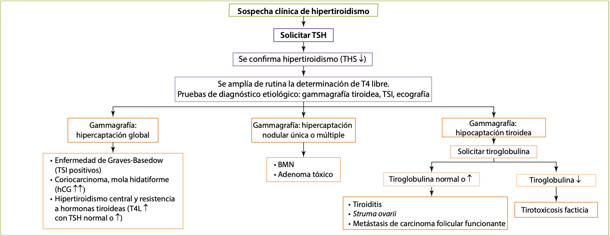
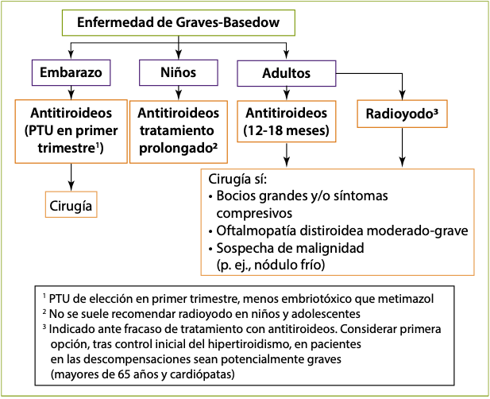
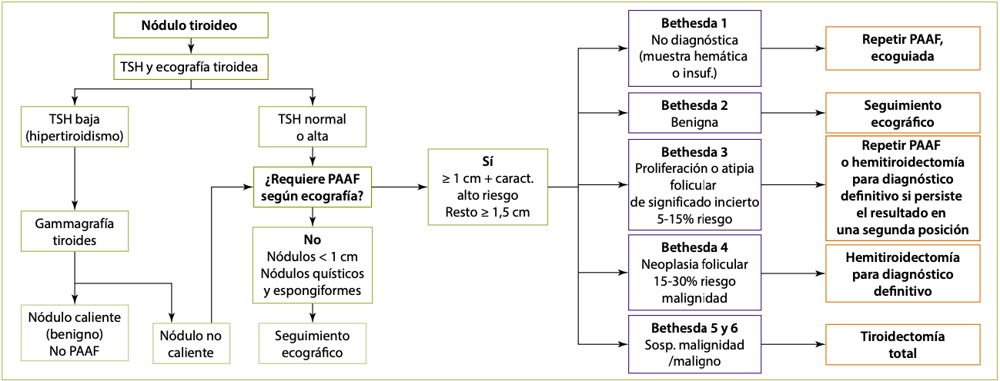
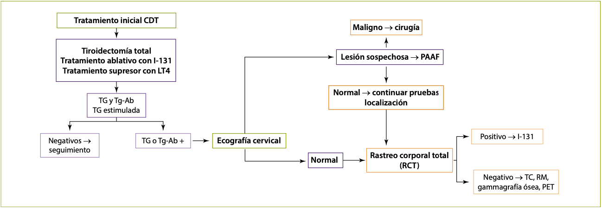

# Enfermedades de tiroides

## Síndrome del eutiroideo enfermo o de enfermedad sistémica no tiroidea
Alteraciones en las concentraciones de las hormonas tiroideas circulantes asociado a enfermedades graves, traumatismos y/o estrés fisiológico sin que exista una enfermedad real a nivel del tiroides.

El patrón hormonal de T3 baja con T4 y TSH normales o bajas es compatible con el síndrome de enfermedad sistémica no tiroidea y con el hipotiroidismo central. El contexto clínico permite favorecer un diagnóstico sobre el otro (p. ej., paciente con sepsis ingresado en UVI o politraumatizado grave orienta hacia síndrome de enfermedad sistémica no tiroidea). Además, es característico del síndrome del eutiroideo enfermo encontrar unos niveles de rT3 elevados.

## Bocio simple
Incremento de volumen de la glándula tiroidea sin nódulos y cuya etiología no sea inflamatoria ni tumoral.

Causas de bocio (General):
- Déficit de yodo (causa más frecuente)
- Bociógenos: mandioca, col, repollo, fármacos antitiroideos, amiodarona, litio, compuestos yodados (contrastes yodados)
- Enfermedades inflamatorias:
	- Autoinmunitarias (tiroiditis autoinmunitarias)
	- Infecciosas (tiroiditis bacteriana y vírica)
	- Tiroiditis posterior al uso de radioyodo
- Enfermedades infiltrativas: tiroiditis de Riedel, amiloidosis, hemocromatosis, histiocitosis, cistinosis
- Alteraciones congénitas:
	- Hemiagenesia tiroidea
	- Quiste tirogloso
	- Mutaciones del gen NIS, peroxidasa tiroidea, oxidasas tiroideas (THOX), pendrina, receptor de TSH, tiroglobulina, proteína de membrana Gs, desyodasas...
- Neoplasias benignas y malignas
- Otras: acromegalia, adenoma hipofisario productor de TSH, mola hidatiforme y coriocarcinoma

>El síndrome de Pendred se produce por un defecto en la organificación del yodo por déficit de la enzima pendrina y se hereda de forma autosómica recesiva. Clínicamente, se caracteriza por bocio, sordera neurosensorial y eutiroidismo o hipotiroidismo leve.

### Clínica
Patrón hormonal tiroideo normal. La clínica resulta de los síntomas compresivos producidos a nivel local por el aumento de tamaño de la glándula tiroides:
- Por afectación de las estructuras vasculares cervicales se puede producir lo que se conoce como signo de Pemberton (aparición de congestión facial al mantener los brazos levantados, pudiendo llegar incluso a producirse un síncope).
- La afectación de los nervios laríngeos recurrentes (disfonía) es excepcional y su presencia debe hacer pensar en la posibilidad de un cáncer de tiroides.

### Diagnóstico y tratamiento
Se debe determinar autoanticuerpos antitiroideos para descartar procesos autoinmunitarios en fase de eutiroidismo.

Rx de Tórax o TC para valorar si existe desplazamiento traqueal o compresión de la vía aérea.

Clínica compresiva:
- Cirugía (tiroidectomía subtotal o casi total)

Asintomático:
- Vigilar evolución
- Terapia supresora con levotiroxina
- Radioyodo
- Sal yodada en casos de déficit de yodo

>La administración de dosis altas de yodo a estos pacientes puede desencadenar una tirotoxicosis (efecto Jod-Basedow).

### Bocio multinodular
Lo más habitual es la evolución desde un bocio simple (más frecuentemente por déficit de yodo) sobre el que aparecen múltiples nódulos. Estos nódulos pueden desarrollar autonomía funcional (funcionamiento independiente de la TSH) y dar lugar a un hipertiroidismo (Bocio multinodular tóxico).

El diagnóstico y tratamiento son similares a los del bocio simple, aunque el tratamiento supresor con levotiroxina es menos eficaz que en el bocio simple.

## Hipotiroidismo

>Cretinismo: Cuando el hipotiroidismo se manifiesta a partir del nacimiento y causa anomalía del desarrollo.

>Mixedema: hipotiroidismo grave con acumulación de mucopolisacáridos hidrófilos en la dermis, ocasionando un engrosamiento de los rasgos faciales y una induración pastosa de la piel.

>En caso de sospecha de insuficiencia suprarrenal concomitante (síndrome poliglandular autoinmunitario, panhipopituitarismo o coma mixedematoso), y hasta descartar su presencia, se debe iniciar el tratamiento con corticoides previamente a la administración de levotiroxina, para evitar desencadenar una insuficiencia suprarrenal aguda.

### Etiología
Primario (> 95%):
- Déficit de yodo (causa más frecuente a nivel mundial)
- Tiroiditis de Hashimoto (causa más frecuente en países desarrollados)
- Paso transplacentario de anticuerpos bloqueantes del receptor de TSH (transitorio)
- Posterior a radioyodo o radioterapia cervical
- Posquirúrgico
- Ingesta excesiva de yodo (efecto Wolff-Chaikoff ): transitorio en tiroides sanos, más prolongado en tiroides con afectación autoinmunitaria de base
- Tiroiditis: subaguda o silente (generalmente transitorio)
- Hipoplasia o aplasia tiroidea, tiroides ectópico
- Déficit congénito de biosíntesis de hormonas tiroideas
- Fármacos: litio, antitiroideos, amiodarona, inhibidores de las tirosinacinasas

Hipofisario e hipotalámico (< 5%)
- Hipopituitarismo (congénito, adenoma hipofisario, cirugía o radioterapia hipofisaria, enfermedades infiltrativas...)

### Manifestaciones clínicas
#### 1. Hipotiroidismo congénito
Se manifiesta por la persistencia de la ictericia fisiológica, llanto ronco, estreñimiento, somnolencia y problemas de alimentación.

Se realizan pruebas de cribado sistemático en todos los recién nacidos a las 48-72 horas de vida, dado que el tratamiento debe instaurarse precozmente para preservar el desarrollo intelectual.

#### 2. Cretinismo
Talla baja, rasgos toscos y lengua prominente, nariz chata y de base ancha, separación de los ojos, escasez de vello, sequedad de piel, abdomen prominente, retraso en la edad ósea, alteración del desarrollo mental y retraso de la dentición.

#### 3. Infancia y edad adulta
Niños mayores: Manifestaciones intermedias entre el infantil y el adulto, predominando la talla baja y el retraso puberal.

Adulto: Síntomas iniciales poco específicos y de aparición progresiva.
- Fatiga, letargia, estreñimiento, intolerancia al frío, miopatía, síndrome del túnel carpiano y trastornos menstruales.
- Deterioro progresivo de las actividades intelectuales y motoras, pérdida de apetito y aumento de peso.
- La piel se vuelve seca y áspera, el vello se cae, la voz se hace más ronca y puede aparecer apnea del sueño.

#### 4. Mixedema
Si el cuadro evoluciona, aparece amimia, palidez y frialdad de la piel, escasez de vello con alopecia de cola de cejas, edema periorbitario y macroglosia.

El corazón puede aumentar de tamaño por dilatación y derrame pericárdico (incluso taponamiento). Puede existir íleo adinámico, megacolon y obstrucción intestinal.

#### 5. Coma mixedematoso
Si el paciente con hipotiroidismo grave no se trata, puede desarrollar un cuadro grave con estupor e hipotermia, que puede ser mortal.

### Diagnóstico
Depende en gran medida de las determinaciones de laboratorio.
Anticuerpos anti-peroxidasa tiroidea (anti-TPO) y anti-tiroglobulina (anti-TG) son positivos en las tiroiditis autoinmunitarias en el 90-100% de los casos.

En el ECG es característica la bradicardia, la disminución de amplitud de los complejos QRS y la inversión de la onda T.
Ecografía cervical si se detecta nodularidad o bocio de gran tamaño a la exploración física.

<table>
   <thead>
    <tr>
      <th>Enfermedad</th>
      <th>TSH</th>
      <th>T4L</th>
      <th>T3L</th>
    </tr>
   </thead>
   <tbody>
    <tr>
      <th>Hipotiroidismo subclínico</th>
      <td>Alta</td>
      <td>Normal</td>
      <td>Normal</td>
    </tr>
    <tr>
      <th>Hipotiroidismo primario</th>
      <td>Alta</td>
      <td>Baja</td>
      <td>Baja</td>
    </tr>
    <tr>
      <th>Hipotiroidismo central</th>
      <td>Baja/normal</td>
      <td>Baja</td>
      <td>Baja</td>
    </tr>
    <tr>
      <th>Enfermedad sistémica no tiroidea (síndrome del eutiroideo enfermo)</th>
      <td>Baja/normal</td>
      <td>Baja/normal</td>
      <td>Baja (rT3 alta)</td>
    </tr>
    <tr>
      <th>Hipertiroidismo subclínico</th>
      <td>Baja</td>
      <td>Normal</td>
      <td>Normal</td>
    </tr>
    <tr>
      <th>Hipertiroidismo primario</th>
      <td>Baja</td>
      <td>Alta</td>
      <td>Alta</td>
    </tr>
    <tr>
      <th>Tirotoxicosis por T3 exógena</th>
      <td>Baja</td>
      <td>Baja</td>
      <td>Alta</td>
    </tr>
    <tr>
      <th>Hipertiroidismo central/ resistencia a hormonas tiroideas</th>
      <td>Normal/alta</td>
      <td>Alta</td>
      <td>Alta</td>
    </tr>
  </tbody>
</table>

**Tabla 3. Perfil hormonal tiroideo en diferentes patologías tiroideas.**

#### Hipotiroidismo subclínico
Situación en la que la T4 libre y la T3 son normales, pero la TSH en suero está elevada.

Tratamiento siempre en:
- Mujeres embarazadas o con deseos de gestación
- Niños y adolescentes
- TSH ≥ 10 µU/ml

Con TSH entre 5-10 µU/ml en:
- Clínica compatible con hipotiroidismo (valorar ensayo terapéutico y reevaluar clínicamente)
- Bocio o autoinmunidad tiroidea
- No tratar y vigilar evolución en ancianos y cardiópatas

### Tratamiento
>- levotiroxina (L-T4)
>- levotironina (L-T3)

Es mas utilizado la L-T4 por su potencia uniforme y larga vida media (7 días).

Durante el embarazo, los requerimientos diarios de levotiroxina aumentan entre un 30-50% a partir de las 4-6 semanas de gestación, retornando a los valores habituales tras el parto. Los objetivos de control deseables son ligeramente inferiores a los de la población general.

En el caso del coma mixedematoso, tratamiento inmediato con L-T4 intravenosa y hidrocortisona (para evitar que se pueda desencadenar una crisis suprarrenal).

## Hipertiroidismo
>Tirotoxicosis: Exceso de acción de las hormonas tiroideas sobre los tejidos periféricos
>Hipertiroidismo: Exceso de secreción de hormona tiroidea desde el tiroides

Se presenta con mayor frecuencia en el sexo femenino.

### Etiología
#### A. Enfermedad de Graves-Basedow
Causa más frecuente de hipertiroidismo en el adulto en edades medias de la vida, y especialmente en mujeres jóvenes, siendo muy infrecuente su aparición en la infancia. Relacionado con HLA-DR3 y HLA-B8.

Asociación de hipertiroidismo, bocio difuso y signos extratiroideos: oftalmopatía (50%), mixedema pretibial (5-10%).

Presencia en el suero de autoanticuerpos (IgG) estimulantes del tiroidesfrente al receptor de TSH (TSH-R-Ab), que son capaces de inducir hipersecreción hormonal.

Puede asociarse a anemia perniciosa, vitíligo, miastenia gravis, insuficiencia suprarrenal u ovárica primarias, artritis reumatoide o lupus eritematoso.

>Hipertiroidismo neonatal: Se observa en niños nacidos de madres con historia de hipertiroidismo por enfermedad de Graves-Basedow (< 5% de los mismos).

#### B. Bocio multinodular hiperfuncionante
Causa más frecuente de hipertiroidismo en el anciano y afecta con más frecuencia a las mujeres. En algunas ocasiones, hipertiroidismo subclínico, en otros casos hiperfunción tiroidea franca.

Tiroides multinodular con varios nódulos hiperfuncionantes (“calientes” en la gammagrafía) que alternan con otros normofuncionantes o hipofuncionantes (“fríos” gammagráficamente).

#### C. Adenoma autónomo hiperfuncionante (adenoma tóxico)
20% de los pacientes portadores de un adenoma tiroideo. Más frecuente en edades avanzadas (como el bocio multinodular) y tiene una proporción mujer/varón alta (como la enfermedad de Graves). Se caracteriza por un nódulo de gran tamaño que presenta captación muy aumentada del radiotrazador.

#### D. Fenómeno Jod-Basedow
El yodo se encuentra en altas concentraciones en contrastes radiológicos orales o intravenosos, en preparados expectorantes y en la amiodarona.

Efectos del yodo sobre la glándula tiroides:
- Inhibición de la síntesis de hormonas tiroideas (efecto Wolff-Chaikoff). Este efecto dura poco tiempo porque existen fenómenos de escape
- Inhibe la liberación de hormonas tiroideas
- Inhibe la captación de yodo por el tiroides
- El yodo liberado de los contrastes yodados puede inhibir la conversión periférica de T4 en T3
- Puede producir tirotoxicosis (fenómeno de Jod-Basedow) en pacientes predispuestos por bocio simple o bocio multinodular de larga evolución
- Puede producir bocio normofuncionante o incluso hipotiroidismo (mixedema por yodo) con la administración crónica en pacientes con enfermedad autoinmunitaria del tiroides
- Administrado antes de la cirugía en la enfermedad de Graves, produce una fibrosis de la glándula y disminuye la vascularización

>A pesar de que existe una hiperfunción tiroidea, la gammagrafía del Jod-Basedow suele ser hipocaptante debido a que el tiroides se encuentra saturado de yodo y es incapaz de captar el radiotrazador administrado para la prueba.

#### E. Mola hidatiforme, coriocarcinoma y embarazo
Cuando las concentraciones séricas de hCG, estimuladora débil del tejido tiroideo, exceden las 3.000 UI/ml, puede existir hipertiroidismo.

#### F. Tiroiditis
Pueden cursar con una fase transitoria de hipertiroidismo, como consecuencia de la destrucción inflamatoria de la glándula y la liberación plasmática de las hormonas previamente sintetizadas.

La destrucción tisular que ocurre tras el tratamiento con I-131 puede inducir a una exacerbación de hipertiroidismo (tiroiditis posyodo radiactivo).

#### G. Struma ovarii
Forma especial de teratoma en la que el tejido tiroideo representa más del 50% del tumor capaz de producir hipersecreción de hormona tiroidea de forma ectópica.

#### I. Tirotoxicosis facticia
La tirotoxicosis facticia por ingesta de hormona tiroidea cursa con un hipertiroidismo primario a expensas de T4 o T3 (depende del que se de), con gammagrafía no captante y tiroglobulina baja (la tiroglobulina en las tiroiditis estará elevada, aunque excepcionalmente puede encontrarse disminuida si los anticuerpos antitiroglobulina son positivos).

#### J. Disfunción tiroidea por amiodarona
Hipotiroidismo:
- Etiopatogenia: Efecto Wolff-Chaikoff por contenido de yodo del fármaco.
- Prevalencia entre el 5-15% de los pacientes tratados.
- Más frecuente en mujeres y sujetos con autoinmunidad tiroidea.
- Aparición en el primer año de tratamiento.
- Tratamiento con levotiroxina. No es imprescindible la suspensión de amiodarona.

Hipertiroidismo Tipo 1 o hipertiroidismo con hiperfunción:
- Etiopatogenia: efecto Jod-Basedow.
- Más frecuente en antecedentes de enfermedad de Graves o BMN.
- Gammagrafía hipercaptante o normocaptante (aunque puede ser hipocaptante).
- Aumento de vascularización en ecografía Doppler.
- Tratamiento: suspender amiodarona si es posible. Antitiroideos y perclorato.

Hipertiroidismo Tipo 2 o tiroiditis por amiodarona:
- Etiopatogenia: activación lisosómica inducida por el fármaco que conduce a tiroiditis destructiva.
- Más frecuente sin antecedentes de enfermedad tiroidea.
- Gammagrafía hipocaptante.
- Disminución de la vascularización en ecografía Doppler.
- Incremento de IL-6 circulante.
- Tratamiento: suspender amiodarona si es posible. Las formas leves se resuelven espontáneamente sin tratamiento (50% de los casos) aunque pueden desembocar en un hipotiroidismo. Glucocorticoides en dosis elevadas ± contrastes yodados.

>La interrupción del tratamiento con amiodarona no revierte de manera inmediata ninguno de los dos tipos de tirotoxicosis.

>De manera general, se suele recomendar retirar el fármaco una vez el paciente esté cardiológicamente estable (frecuencia cardíaca controlada, sin arritmias graves y sin insuficiencia cardíaca).

#### K. Resistencia a hormonas tiroideas
La resistencia a hormonas tiroideas (síndrome de Refetoff) es un síndrome producido por una disminución del efecto de la hormona tiroidea en los órganos diana. Se debe a mutaciones en el gen de la subunidad β de los receptores de hormonas tiroideas (TR-β).

Patología con herencia autosómica dominante y niveles elevados de hormonas tiroideas con una falta de supresión adecuada de la TSH (normal o elevada).
Los pacientes no suelen presentar clínica de hipotiroidismo dado que la resistencia periférica a las hormonas tiroideas suele ser parcial y compensada por la elevación de las mismas.

De hecho, dado que las mutaciones no afectan habitualmente al TR-a, predominante en el tejido cardiovascular, los pacientes pueden presentar taquicardia y otros signos de hipertiroidismo leve.

Tratamiento sintomático con dosis bajas de β-bloqueantes si hay taquicardia.

### Manifestaciones clínicas
#### A. Manifestaciones generales
>La exposición tisular a niveles elevados de hormonas tiroideas condiciona un estado catabólico con incremento en el consumo de oxígeno y aumento del tono simpático

**Figura 11. Clínica del hipertiroidismo.**

Aspecto pletórico, con nerviosismo, debilidad, labilidad emocional, disminución del rendimiento, sudoración excesiva e intolerancia al calor.

Suele tener aumentado el tránsito intestinal y el número de deposiciones. El apetito está incrementado, pero la pérdida calórica generalmente condiciona una pérdida de peso paradójica.

El exceso de hormonas tiroideas puede causar diversos tipos de arritmia como fibrilación auricular.

La resorción del hueso excede a la formación, provocando hipercalciuria y, ocasionalmente, hipercalcemia. El hipertiroidismo no tratado de larga evolución puede cursar con reducción de masa ósea.

A nivel neuromuscular causa debilidad generalizada, miopatía proximal, temblor fino distal, mioclonías, movimientos coreoatetósicos (sobre todo, en los niños) e hiperreflexia.

A nivel cutáneo, prurito, mixedema localizado o pretibial (enfermedad de Graves-Basedow), acropaquias, alopecia y onicólisis.

El hipertiroidismo altera la fertilidad puede causar oligoamenorrea o disfunción eréctil.

#### B. Hipertiroidismo apático o enmascarado
>El hipertiroidismo en los pacientes ancianos puede simular un hipotiroidismo (hipertiroidismo apático) con lentitud mental, apatía, depresión, etcétera, aunque se acompaña de las manifestaciones cardiovasculares del aumento de hormonas tiroideas (descartar hipertiroidismo en insuficiencia cardíaca o arritmia cardíaca de etiología no filiada).

### Diagnóstico
- Determinación de TSH.
- Determinación de niveles séricos de hormonas tiroideas.

#### A. Diagnóstico etiológico
- Ecografía tiroidea: Permite evaluar la presencia de nódulos tiroideos, así como la presencia de zonas hipoecogénicas en el parénquima tiroideo sugestivas de tiroiditis inflamatorias o autoinmunitarias.
	En Graves-Basedow, parénquima tiroideo con aumento difuso de vascularización, en algunos casos tan marcado que se habla de infierno tiroideo.
	En las tirotoxicosis por amiodarona hay vascularización aumentada en las tipo 1 y disminuida en las tipo 2.
- Gammagrafía tiroidea realizada con I-131, I-123 o Tc-99. Útil para el diagnóstico del bocio multinodular y el adenoma tóxico (hiperfuncionantes) y su diferenciación de la enfermedad de Graves-Basedow.
	En el bocio multinodular hiperfuncionante, captación irregular con múltiples nódulos en diversos estados funcionales (calientes, templados y fríos).
	En el adenoma tóxico, el radiotrazador se acumula en un solo nódulo que suprime el resto de la glándula.
	En la enfermedad de Graves-Basedow, captación homogénea y difusa en un tiroides globalmente aumentado de tamaño.
- Autoanticuerpos:
	- Primera determinación a realizar en pacientes jóvenes, con alta sospecha de enfermedad de Graves-Basedow.
	- Diagnóstico etiológico de pacientes con orbitopatía de Graves con normofunción tiroidea
	- Predicción del riesgo de recidiva al finalizar el tratamiento
	- Evaluación del riesgo de hipertiroidismo neonatal por paso en gestantes con enfermedad de Graves-Basedow.

| Tirotoxicosis según                                                                                                              | captación gammagráfica                                                |
| -------------------------------------------------------------------------------------------------------------------------------- | --------------------------------------------------------------------- |
| **Captación aumentada globalmente:** Enfermedad de Graves-Basedow Tumores productores de TSH Tumores productores de hCG |      |
| **Captación aumentada de manera localizada:**   BMNT y adenoma tóxico                                                         |  |
| **Captación disminuida:** Tiroiditis Fenómeno de Jod-Basedow Tirotoxicosis facticia Struma ovarii                 |            |

**Tabla 8. Clasificación de los estados de tirotoxicosis según la captación gammagráfica.**

#### B. Diagnóstico diferencial

**Figura 12. Diagnóstico diferencial del hipertiroidismo.**

### Tratamiento farmacológico
#### A. Antitiroideos
>Metimazol o MMI, carbimazol y propiltiouracilo o PTU

Inhiben la peroxidasa tiroidea (Inhiben la síntesis de hormonas tiroideas).

>El PTU, además, posee una acción extratiroidea, inhibiendo parcialmente la conversión periférica de T4 a T3 (inhibición de las desyodasas).

Los efectos adversos más frecuentes de los antitiroideos, junto con el hipotiroidismo yatrógeno, son las alteraciones cutáneas (rash, eritrodermia), y los más graves la agranulocitosis (granulocitos < 500/mm3) y la hepatitis fulminante (PTU).

Los pacientes con agranulocitosis suelen debutar con fiebre y dolor de garganta, por lo que deben ser advertidos para que acudan a su médico.

#### B. β-bloqueantes
Útiles como tratamiento coadyuvante, ya que producen una rápida mejoría de la sintomatología adrenérgica del cuadro (temblor, palpitaciones, ansiedad).

#### C. Yoduro inorgánico
Produce un llamativo y rápido alivio en el paciente hipertiroideo. El principal inconveniente es la limitación de su acción, ya que se produce el fenómeno de escape de la acción antitiroidea en el plazo de 1-2 semanas.

>En dosis farmacológicas, es capaz de limitar su propio transporte en las células tiroideas y de inhibir la organificación, impidiendo la síntesis de yodotirosinas (efecto Wolff-Chaikoff) y la liberación de hormonas tiroideas.

#### D. Glucocorticoides
En dosis altas inhiben la conversión periférica de T4 a T3 y la secreción hormonal tiroidea en pacientes con enfermedad de Graves-Basedow. Se emplean, generalmente, en el tratamiento de la crisis tirotóxica.

#### E. Radioyodo
Es necesario un periodo previo de tratamiento con antitiroideos (al menos 1 mes) con el objeto de normalizar la función tiroidea antes del tratamiento con radioyodo, especialmente en pacientes ancianos, y deben suspenderse 3-7 días antes de la administración de la dosis terapéutica.

El tratamiento antitiroideo debe restaurarse unos 7 días después, en espera del efecto de la destrucción glandular por el I-131, que puede tardar entre 3-12 meses.

Los efectos adversos más importantes son la persistencia del hipertiroidismo y el desarrollo de hipotiroidismo.

El daño inicial de la radiación puede producir tiroiditis con liberación al plasma de hormonas tiroideas y exacerbación de los síntomas del hipertiroidismo en las 2 semanas posteriores a administrar el yodo.

El I-131 está contraindicado como tratamiento del hipertiroidismo en gestantes y durante la lactancia, o ante sospecha de malignidad. Se recomienda a las mujeres tratadas con radioyodo que eviten el embarazo, al menos hasta 6 meses después de la administración del isótopo.

### Tratamiento quirúrgico
El tratamiento quirúrgico es de elección en bocio multinodular tóxico, adenoma tóxico o enfermedad de Graves-Basedow cuando presenta clínica compresiva.

La tiroidectomía subtotal o casi total (menor riesgo de recurrencia) son las técnicas quirúrgicas de elección en enfermedad de Graves o BMNT, bastando con la hemitiroidectomía en el adenoma tóxico.

Previamente a la cirugía, tratamiento médico hasta alcanzar el eutiroidismo, con objeto de evitar el riesgo de crisis tirotóxica durante la intervención. Es frecuente la utilización de lugol (yoduro potásico) porque disminuye la vascularización de la glándula, reduciendo así el riesgo de sangrado durante la intervención.

Complicaciones:
- Daño del nervio laríngeo recurrente
- Sangrado masivo
- Hipoparatiroidismo (transitorio o permanente)
- Hipotiroidismo permanente

### Tratamiento en situaciones concretas
#### A. Enfermedad de Graves

**Figura 14. Actitud terapéutica en la enfermedad de Graves.**

#### B. Bocio multinodular tóxico
El tratamiento de elección es el radioyodo, dada la edad avanzada de los pac#ientes que lo suelen presentar. La dosis de I-131 que se necesita para conseguir la curación es superior a la de la enfermedad de Graves-Basedow (10-50 mCi).

#### C. Adenoma tóxico
El tratamiento de elección consiste en la administración de radioyodo, con dosis similares a las empleadas en el BMNT.

#### D. Tiroiditis
Habitualmente es leve y poco duradero, generalmente no precisa tratamiento y, si las manifestaciones son llamativas, puede controlarse bien con bloqueantes β-adrenérgicos.

#### E. Crisis cardíaca aislada
1. Control de la tirotoxicosis con antitiroideos
	>Antitiroideos + yoduro si la situación es urgente
	>Yoduro nunca antes de los antitiroideos para evitar exacerbar el hipertiroidismo
2. Control de la descompensación cardíaca con digital
	>Asociar β-bloqueantes si no existe insuficiencia cardíaca

#### F. Crisis o tormenta tiroidea
Irritabilidad, delirium o coma, fiebre, taquicardia, insuficiencia cardíaca, vómitos y diarrea.
1. Medidas de soporte (Elevada moratalidad)
2. Alivio de la tirotoxicosis de forma rápida. Grandes dosis de antitiroideos, yodo o contrastes yodados, β-bloqueantes y dexametasona (DXM) en dosis altas.

>En el tratamiento de la hipertermia de una crisis tiroidea nunca se deben administrar AAS ni salicilatos, puesto que alteran la unión de las hormonas tiroideas a proteínas plasmáticas y aumentan la fracción libre circulante de la hormona. Además, el β-bloqueante de elección es propranolol, porque bloquea la desyodación de T4 a T3 a nivel periférico.

## Tiroiditis
### Tiroiditis aguda bacteriana (o piógena o supurativa)
Los gérmenes implicados más frecuentemente son Staphylococcus aureus, estreptococo hemolítico y neumococo. En pacientes con sida puede haber tiroiditis aguda por Pneumocystis jirovecci.

Dolor, calor, rubor y tumefacción en cara anterior del cuello, síntomas sistémicos de infección.

Fiebre, leucocitosis con desviación izquierda.

Tratamiento con Antibióticos y drenaje quirúrgico.

### Tiroiditis subaguda viral (de Quervain, granulomatosa o de células gigantes)
Los síntomas de tiroiditis suelen aparecer después de una infección de vías respiratorias altas y se caracterizan por malestar general, febrícula y dolor, generalmente unilateral, sobre el tiroides o referido hacia los oídos o la mandíbula.

En la exploración, destaca una gran sensibilidad a la palpación del tiroides, que se encuentra aumentado de tamaño y es nodular.

Es característico el aumento de la velocidad de sedimentación.

En una primera etapa T4 y T3 están elevadas y TSH suprimida (diagnóstico diferencial con la enfermedad de Graves-Basedow y otros hipertiroidismos), posteriormente, a medida que se vacía la glándula de hormona, se produce una fase de hipotiroidismo.

Este proceso evoluciona a lo largo de varios meses y se produce la recuperación completa de la función tiroidea, persistiendo un hipotiroidismo crónico en menos del 5% de los casos.

En aquellos casos más leves los síntomas se suelen controlar con AINE, siendo necesaria la utilización de esteroides en los que presentan más gravedad.

### Tiroiditis linfocitaria con tirotoxicosis transitoria (silente o indolora)
La palpación tiroidea demuestra una glándula aumentada de tamaño, indolora y de consistencia aumentada.

La velocidad de sedimentación es normal, los anticuerpos antiperoxidasa suelen ser positivos en títulos bajos y las hormonas tiroideas están elevadas con TSH suprimida en su fase inicial.

Es frecuente su aparición después del embarazo (tiroiditis posparto). El hipotiroidismo puede cronificarse hasta en un 20% de las formas esporádicas y en un 50% de las formas posparto, recomendándose cribado con TSH anual.

Tratamiento con levotiroxina.

### Tiroiditis linfocitaria crónica (de Hashimoto o bocio linfoide)

Aparece con más frecuencia en mujeres de edad media. Al comienzo, la reserva tiroidea suele estar intacta o mostrar un hipotiroidismo subclínico. El bocio es su principal manifestación.

Conforme avanza la enfermedad, se desarrolla hipotiroidismo franco. Existen casi siempre títulos elevados de anticuerpos antiperoxidasa.

Tratamiento con tiroxina.

Histológicamente, infiltración linfocitaria difusa y algunas células epiteliales con alteraciones oxífilas en el citoplasma, características de la tiroiditis de Hashimoto.

Existe un aumento de incidencia del linfoma tiroideo.

>Hashitoxicosis: Algunos pacientes presentan hipertiroidismo (10%) y títulos elevados de TSI.

### Tiroiditis fibrosante (de Riedel o estruma de Riedel)
Glándula aumentada de tamaño, dura e inmóvil. Se asocia a veces con fibrosis mediastínica y retroperitoneal.

La captación de yodo está disminuida. El diagnóstico diferencial se debe establecer con las neoplasias de tiroides, y el tratamiento es quirúrgico si existen síntomas de compresión.

## Patología nodular tiroidea
### Diagnóstico
Mayor en las mujeres y a medida que aumenta la edad.

<table>
  <tbody>
    <tr>
      <th>Antecedentes</th>
      <td>
        <ul>Familiares con cáncer de tiroides o MEN-2</ul>
        <ul>Radiación en cabeza o cuello o radioterapia de acondicionamiento para trasplante de médula ósea infantil (carcinoma papilar)</ul>
        <ul>Déficit de yodo (carcinoma folicular)</ul>
      </td>
    </tr>
    <tr>
      <th>Anamnesis</th>
      <td>
        <ul>Edad > 70 o < 20 años</ul>
        <ul>Sexo masculino</ul>
        <ul>Nódulo palpable de aparición reciente, de crecimiento rápido e indoloro</ul>
        <ul>Afectación del nervio laríngeo recurrente (disfonía)</ul>
      </td>
    </tr>
    <tr>
      <th>Exploración física</th>
      <td>
        <ul>Tamaño > 4 cm</ul>
        <ul>Consistencia pétrea</ul>
        <ul>Fijación a estructuras vecinas (no desplazable con la deglución)</ul>
        <ul>Adenopatías palpables</ul>
      </td>
    </tr>
    <tr>
      <th>Analítica</th>
      <td>Elevación de calcitonina y/o CEA</td>
    </tr>
    <tr>
      <th>Ecografía tiroidea</th>
      <td>
        <ul>Nódulo: hipoecogenicidad, microcalcificaciones, bordes groseros e irregulares, ausencia de halo periférico, diámetro AP > transversal (crece en profundidad)</ul>
        <ul>Adenopatía: forma redondeada, microcalcificaciones, áreas quísticas, aumento de la vascularización periférica, ausencia de hilio graso</ul>
      </td>
    </tr>
    <tr>
      <th>Gammagrafía tiroidea</th>
      <td>Hipocaptación (nódulo frío)</td>
    </tr>
  </tbody>
</table>

**Tabla 10. Factores de riesgo de malignidad ante un nódulo tiroideo.**

>La presencia de adenopatías constituye un factor de riesgo muy importante para que un nódulo tiroideo sea maligno, y también indica mayor riesgo de recurrencia local en un paciente tratado de cáncer diferenciado de tiroides, pero existe controversia sobre si influye en la supervivencia, sobre todo en sujetos jóvenes.

**Figura 15. Diagnóstico y manejo del nódulo tiroideo.**

#### A. Ecografía cervical
Los nódulos de mayor sospecha de malignidad son los hipoecoicos en especial si presentan:
- Microcalcificaciones
- Crecimiento mayor en sentido anteroposterior que en sentido transverso (más alto que ancho)
- Bordes irregulares o extensión extratiroidea.

>El riesgo es muy bajo en los nódulos espongiformes (microquistes en más del 50% del nódulo) y puramente quísticos.

#### C. Estudio citológico

La PAAF permite diferenciar de forma fiable los nódulos malignos de los benignos en la mayoría de los casos.

>En el caso de diferenciar un adenoma folicular (benigno) de un carcinoma folicular; el criterio es la presencia de invasión capsular y/o vascular, por lo que para el diagnóstico definitivo es necesaria la extirpación quirúrgica y revisión histológica completa de la lesión

Si se ha obtenido un resultado de PAAF no concluyente, la segunda PAAF debe realizarse bajo control ecográfico.

>Se debe valorar antes el resultado de la TSH y de la ecografía cervical. Una TSH baja (hipertiroidismo primario) debida a la presencia de un adenoma tóxico (nódulo caliente confirmado en la gammagrafía tiroidea) o la confirmación ecográfica de un quiste tiroideo puro hará que no se solicite la PAAF, ya que el riesgo de malignidad es < 1%.

#### D. Gammagrafía
Ante un paciente con nódulos tiroideos y determinación de TSH baja, está indicada la realización de una gammagrafía para evaluar el grado de actividad de cada uno de los nódulos.
La demostración de un nódulo frío en la gammagrafía constituye un parámetro sugestivo de carcinoma, aunque sólo el 20% de los nódulos fríos son malignos.

## Tumores malignos del tiroides
### Clasificación
#### A. Tumores metastásicos
Las fuentes más habituales son melanoma, carcinoma de pulmón, mama y esófago.

#### B. Carcinoma medular de tiroides
La lesión se origina sobre las células C o parafoliculares y produce calcitonina.

>Dado que no deriva de células foliculares tiroideas, no tiene ninguna utilidad la determinación de tiroglobulina, el uso de I-131 como prueba de localización o el tratamiento ablativo ni el tratamiento supresor con L-tiroxina.

##### Clínica
Puede presentarse de cuatro formas: en el 75% de los casos es
- Esporádico (75%)
- Familiar (más frecuentemente multicéntrico), como parte de un MEN tipo 2A o tipo 2B, o como un tipo familiar sin otros tumores asociados.

Suele existir adenopatías en el momento del diagnóstico, tiene tendencia a calcificarse y puede producir metástasis a distancia en pulmón, hígado, hueso y SNC.

>Debido a la presencia de formas familiares que pueden asociarse a feocromocitoma, siempre que se sospeche un carcinoma medular de tiroides, se debe realizar determinación de catecolaminas o metanefrinas en plasma u orina de 24 horas para descartarlo, ya que primero hay que operar el feocromocitoma.

##### Diagnóstico
Histológicamente, acúmulos de células C junto con sustancia amiloide.

La inmunohistoquímica refleja tinción para tiroglobulina negativa, y positividad para cromogranina A, calcitonina y CEA.

Se ha identificado el gen responsable en los casos familiares, encontrándose mutaciones en el gen [[Trastornos que afectan a múltiples órganos endocrinos#Neoplasia endocrina múltiple tipo 2 | RET]] (protooncogén).

Calcitonina y CEA sirven de marcadores tumorales para detectar enfermedad residual después del tratamiento quirúrgico.

>La presencia de tejido amiloideo en una histología del tiroides siempre debe hacer pensar en carcinoma medular de tiroides, independientemente de que se describan papilas, acúmulos de células foliculares o focos de anaplasia.

##### Tratamiento
El tratamiento de elección es la cirugía (tiroidectomía total con linfadenectomía central profiláctica), siempre descartando previamente la presencia de feocromocitoma (primero hay que operar el feocromocitoma).

La radioterapia y la quimioterapia convencional tienen un papel paliativo en el tratamiento de la enfermedad residual.

>El tratamiento con fármacos inhibidores de las tirosinacinasas (vandetanib y cabozantinib) ha demostrado retrasar la progresión en cáncer medular de tiroides avanzado.

#### C. Tumores del epitelio folicular
##### Carcinoma papilar
Tumor tiroideo más frecuente (85-90%) y de mejor pronóstico, tiene una frecuencia de presentación bimodal.

Los pacientes con tumores < 4 cm, limitados a la glándula tiroidea o con mínima extensión extratiroidea y sin afectación metastásica a distancia tienen un pronóstico excelente.

Mutaciones en el gen BRAF podrían conferir un peor pronóstico, al asociarse a invasión extratiroidea y diseminación linfática.

La presencia de afectación linfática se asocia con un mayor riesgo de recurrencia.

El carcinoma papilar es el que aparece más frecuentemente relacionado con la radiación craneocervical durante la infancia.

Es rara, pero diagnóstica, la presencia de calcificaciones en grano de arena o cuerpos de psamoma, y siempre existen asociados elementos foliculares.

##### Carcinoma folicular
En sujetos de edad avanzada.

Sólo se diferencia del adenoma folicular benigno por la presencia de invasión de la cápsula o vascular.

Las metástasis pueden llegar a producir hiperfunción tiroidea por el exceso de producción de T4 y T3 (aunque esto es raro).

##### Carcinoma anaplásico
Es de crecimiento rápido, invade y comprime estructuras vecinas y puede ulcerar la piel. A pesar de la cirugía radical, el pronóstico es muy desfavorable, con una supervivencia de meses.

No es útil en su tratamiento el I-131, pues no lo concentra.

Puede confundirse con un linfoma o un sarcoma, por lo que a veces es necesario recurrir a tinciones inmunohistoquímicas para tiroglobulina.

### Tratamiento y seguimiento del carcinoma diferenciado de tiroides (papilar y folicular)
#### A. Tratamiento quirúrgico
En el carcinoma diferenciado de tiroides (CDT) el tratamiento inicial es siempre la cirugía.

Ante una PAAF con resultado de malignidad, tiroidectomía total. En Paciente con hemitiroidectomía previa que se confirma CDT se debe completar la tiroidectomía total

Ganglios:
- Linfadenectomía central o laterocervical si existe afectación ganglionar clínica o radiológica demostrada.
- Linfadenectomía central profiláctica en carcinoma papilar > 4 cm (no en folicular) o con extensión extratiroidea aunque no exista afectación ganglionar clínica operatoria.

**Figura 16. Tratamiento inicial y seguimiento del carcinoma diferenciado de tiroides (CDT).**

#### B. Radioyodo
Después del tratamiento quirúrgico inicial, ablación de los restos tiroideos con I-131 bajo cantidades altas de TSH.

Pacientes con carcinomas papilares unifocales ≤ 1 cm o multifocales con todos los focos menores de 1 cm y sin factores de riesgo de recurrencia no precisan la administración de dosis ablativa de I-131.

Factores de riesgo de recurrencia tras cirugía:
- Edad ≥ 55 años
- Amplia extensión extratiroidea
- Invasión vascular
- Variante histológica agresiva (cualquiera que no sea la variante clásica: variante sólida, células altas, columnar, carcinoma insular, Hürthle pobremente diferenciado
- Afectación ganglionar
- Metástasis a distancia
- Resección tumoral incompleta
- Niveles muy elevados de tiroglobulina

#### C. Tratamiento supresor con L-T4
Los pacientes operados deben recibir tratamiento con hormona tiroidea, ya que presentan un hipotiroidismo posquirúrgico.

En pacientes sin evidencia de enfermedad y bajo riesgo de recurrencia, el objetivo de TSH será entre 0,5-2 μUI/ml, es decir, en el límite bajo de la normalidad. TSH < 0,1 μUI/ml en pacientes con persistencia de enfermedad (tiroglobulina positiva o pruebas de imagen patológicas).

#### D. Seguimiento del CDT. Determinación de tiroglobulina
En condiciones ideales, si con la cirugía y la dosis ablativa de I-131 se han eliminado todos los restos de tejido tiroideo sano y restos tumorales, la TG debería ser indetectable.

Determinar simultáneamente la presencia de anticuerpos antitiroglobulina (TG-Ab), dado que su positividad puede interferir en la interpretación de las cifras de TG.

La persistencia o aumento del título de anticuerpos antitiroglobulina se considera también como un marcador tumoral, dado que traduce la probable existencia de restos tumorales contra los que se están desarrollando los anticuerpos.

<table>
	<thead>
		<th colspan = 3>Excepciones al tratamiento clásico del CDT</th>
	</thead>
	<tbody>
		<tr>
			<th>No precisan tiroidectomía total (hemitiroidectomía suficiente)</th>
			<th>Requieren linfadenectomía central profiláctica</th>
			<th>No precisan radioyodo</th>
		</tr>
			<td>
				<ul>Lesión unifocal < 1 cm</ul>
				<ul>Variante clásica</ul>
				<ul>Sin adenopatías</ul>
				<ul>Sin historia familiar</ul>
				<ul>Sin antecedente RT</ul>
			</td>
			<td>
				<ul>Lesión > 4 cm</ul>
				<ul>Afectación extratiroidea extensa</ul>
			</td>
			<td>
				<ul>Hemitiroidectomía exclusiva</ul>
				<ul>Tumor uni o multifocal con focos < 1 cm y sin factores de riesgo de recurrencia</ul>
			</td>
		<tr>
		</tr>
	</tbody>
</table>

**Tabla 13. Resumen de excepciones al tratamiento clásico del CDT**

#### E. Pruebas de imagen
- Ecografía tiroidea. En caso de imagen sospechosa (restos en lecho quirúrgico, adenopatías) se realiza una PAAF para descartar malignidad.
- Rastreo corporal total (RCT). Se realiza de rutina tras el tratamiento ablativo para intentar localizar posibles focos de tejido tumoral tras la cirugía. Si una lesión capta en el RCT, es susceptible de tratamiento con I-131.

#### F. Otras actuaciones
Si los marcadores tumorales son positivos pero el RCT es negativo, se segurán realizando pruebas de imagen para intentar localizar los restos tumorales (TC, RM, gammagrafía ósea, PET).

Los casos que presenten captación en PET suelen ser más agresivos y es menos probable que respondan a tratamiento con I-131.

# Source
[Enfermedades de tiroides](../../Anexos/Pdf/Endocrino/enfermedades_de_tiroides.pdf)

***Tags:***
#endocrino #tiroides #CTO #MIR
