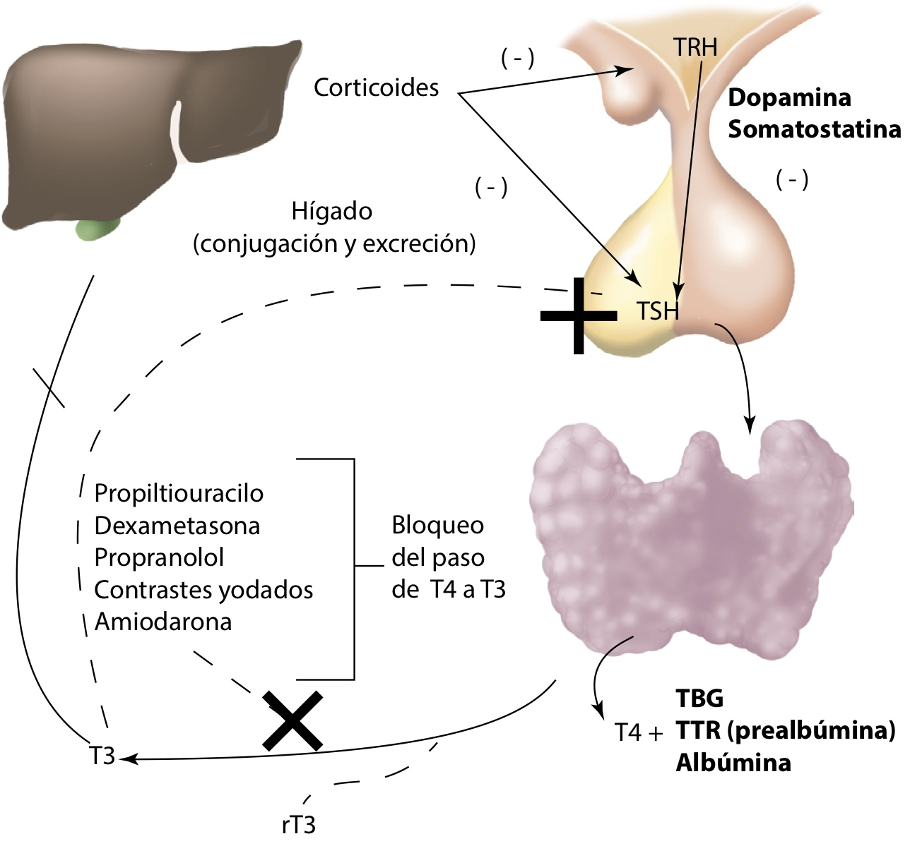
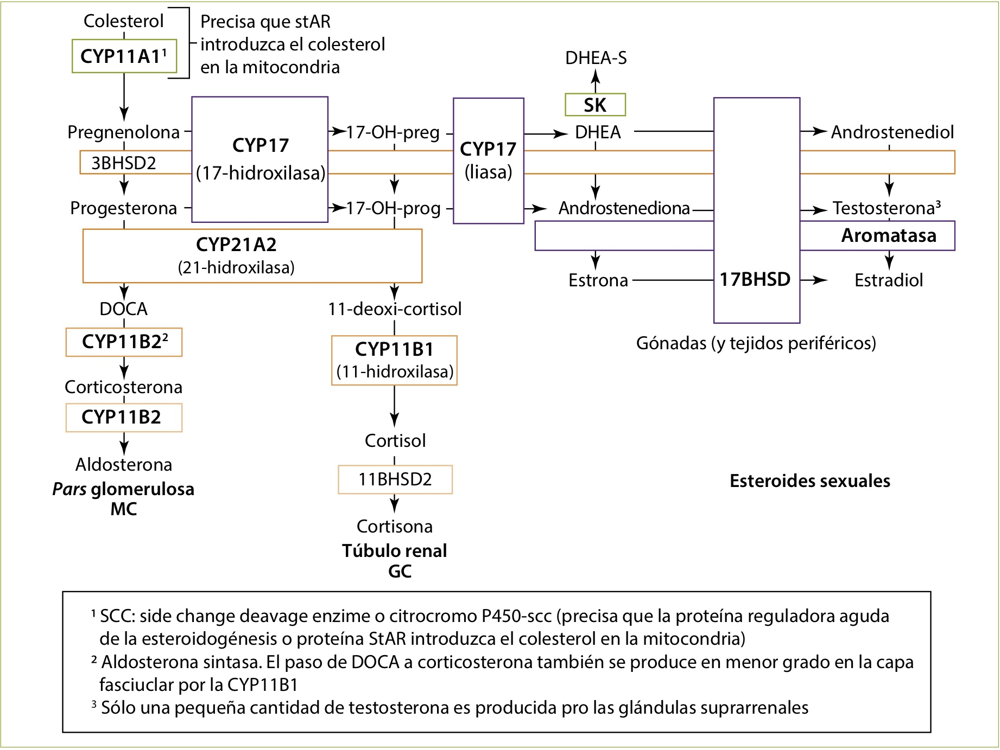
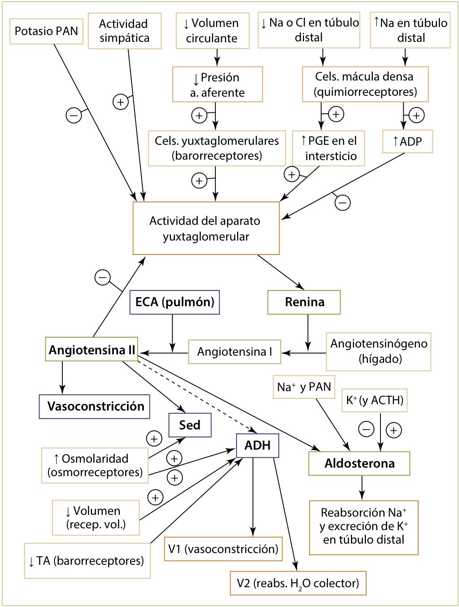
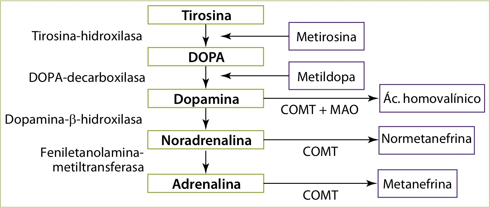
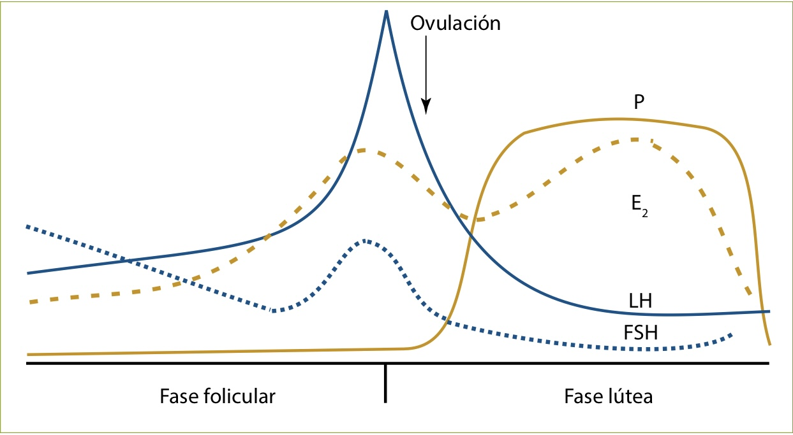
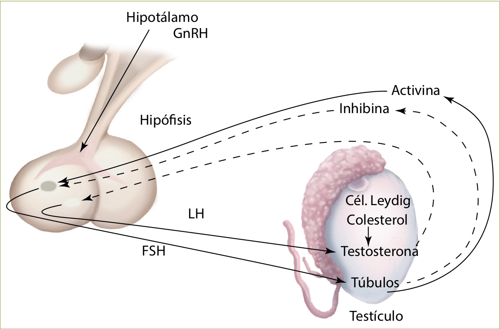
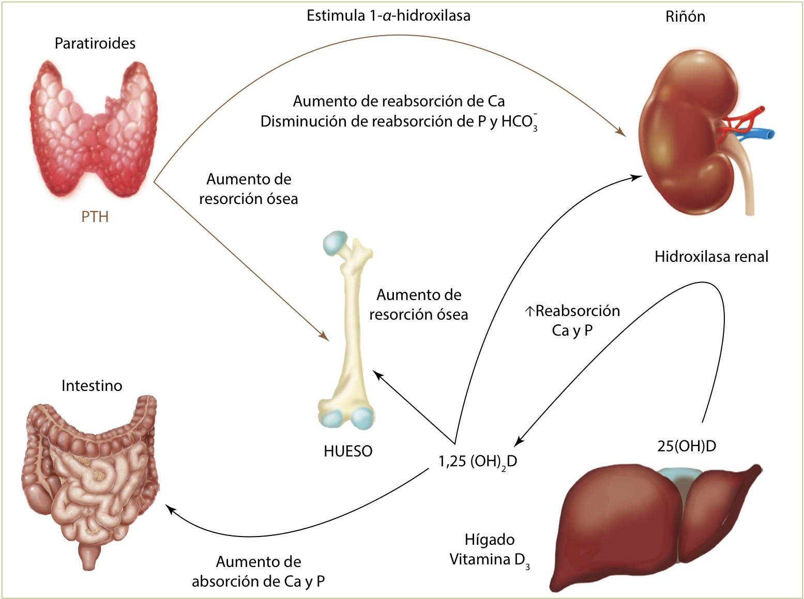
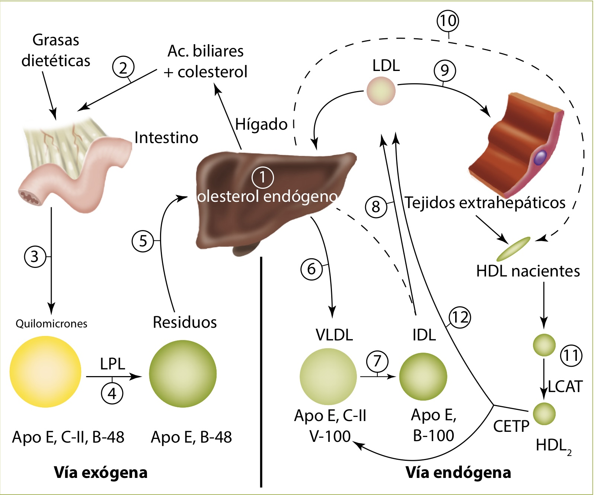

# Fisiología del sistema endocrino

## Introducción
- Aminas. Hormonas tiroideas, dopamina y catecolaminas suprarrenales (adrenalina y noradrenalina).
- Proteínas y péptidos.
- Esteroideas. Hormonas suprarrenales, hormonas sexuales y metabolitos activos de la vitamina D. El precursor común es el colesterol.

 ### Receptores hormonales
- Receptores hormonales de membrana.
	- Receptores de siete dominios transmembrana. Unidos a las proteínas G. Mutaciones en la proteína G, dan lugar a pseudohipoparatiroidismo característicamente.
	- Receptores tirosinacinasa. Crecimiento y la diferenciación.
	- Receptores de citocinas. Aumentan la actividad de las JAK.
	- Receptores serinacinasa. Funciones autocrinas y paracrinas.
	- Receptores unidos a guanidilciclasa (PAN). Aumentan la actividad de la óxido nítrico sintetasa.
- Receptores hormonales citosólicos. Contienen un área de unión al ligando y otra para unión al ADN. Las hormonas esteroideas (suprarrenales, sexuales y metabolitos de lavitamina D) actúan mediante receptores citosólicos.
- Receptores hormonales nucleares. Para las hormonas tiroideas, poseen una zona a la que se une el ligando y otra mediante la que se unen al ADN denominada elemento de respuesta tiroidea (TRE).

## Hormonas hipotalámicas e hipofisarias
#### A. Hormona de crecimiento
La GH se secreta por las células somatotróficas, el 50% de las células de la hipófisis, y tienen una liberación pulsátil característica: Durante el ejercicio, el sueño de ondas lentas, ante traumatismos, estrés físico o sepsis. Mayor liberación 1 hora tras iniciarse el sueño profundo.
Actúa conjuntamente con otros factores de crecimiento similares a la insulina (IGF-1), esteroides sexuales, hormonas tiroideas y otros.
IGF-1 se produce en respuesta al estímulo de la GH, con un nivel máximo en la pubertad.
Los niveles de IGF-1 se utilizarán en la clínica para descartar exceso de hormona de crecimiento, dado que las concentraciones de IGF-1 son más estables que las de GH.
La GH estimula la incorporación de los aminoácidos a las proteínas y aumenta la liberación de los ácidos grasos libres por los adipocitos. Es una hormona contrainsular e inhibe la captación de glucosa por los tejidos.
La GH se estimula por la GHRH, y se inhibe por la somatostatina. Es la primera hormona que se altera cuando existe una lesión del hipotálamo.

#### B. Corticotrofina
La ACTH se produce en las células corticotróficas, el 20% delas células de la hipófisis anterior, a partir de una molécula precursora, la proopiomelanocortina (POMC). Controla la liberación de cortisol.
La CRH hipotalámica es el regulador principal de la ACTH. Estimulan la secreción de ACTH: El estrés, la cirugía, la hipoglucemia, los problemas psíquicos y la vasopresina.
El cortisol induce retroalimentación negativa.

#### C. Gonadotrofinas
La LH y la FSH son liberadas por las células gonadotróficas, que constituyenel 10% de la hipófisis anterior.
La sensibilidada GnRH es baja hasta el inicio de la pubertad; con una respuesta de FSH mayor que la de LH. Con el desarrollo puberal, aumenta la sensibilidad a GnRH y comienza la secreción pulsátil de LH, inicialmente durante el sueño. Durante la vida fértil las pulsaciones de LH aparecen durante el día, y la respuesta de LH a GnRH es mayor que la de FSH.
Una secreción continua de GnRH, por el contrario, inhibiría la secreción de gonadotrofinas.

#### D. Prolactina
Las células lactotróficas, el 10-30% de la glándula hipofisaria (durante el embarazo hasta un 70%).
La prolactina prepara la glándula mamaria para la lactancia a lo largo del embarazo, pero los niveles elevados de estrógenos inhiben la producción de leche y, de esta forma, la lactancia no se inicia hasta después del parto. Tras el mismo, la PRL actúa induciendo y manteniendo la producción de leche al mismo tiempo que reduce la función reproductora y el deseo sexual (inhibe a la GnRH hipotalámica).
La secreción de PRL se frena por el hipotálamo. El principal inhibidor es la dopamina, estimulan la PRL: El estrés, las comidas, el ejercicio físico, la succión del pezón (reflejo de Ferguson-Harris), los opiáceos (inhiben la dopamina), los estrógenos y  el VIP.
Los glucocorticoides y las hormonas tiroideas inhiben débilmente la secreción de PRL.

#### E. Tirotrofina
La TSH se produce en las células tirotróficas, el 5% de las células de la hipófisis anterior. Compuesta por una subunidad a que comparte con FSH, LH y gonadotrofina coriónica (hCG) y una subunidad β característica. Es la responsable de la regulación de las hormonas tiroideas tiroxina (T4) y triyodotironina(T3) que, a su vez, inhiben la producción de TSH. La somatostatina, dopamina y glucocorticoides disminuyen la liberación de TSH.

#### F. Vasopresina
Su principal función es conservar el agua por un mecanismo de concentración de la orina. Para ello, se une al receptor V2, potenciando la reabsorción de agua desde la luz tubular. En dosis suprafisiológicas, puede actuar sobre los receptores V1a y producir vasoconstricción, también estimula la liberación de ACTH y GH (receptoresV1b).
La liberación de ADH depende de:
- La osmolaridad plasmática alta (el principal).
- La disminución del volumen plasmático y/o presión arterial.
- Nicotina, morfina, vincristina, ciclofosfamida, carbamazepina y los tricíclicos.
Etanol, naloxona, y clorpromacina inhiben la liberación de ADH.

#### G. Oxitocina
El mecanismo de estímulo es el contacto del pezón (succión del lactante) y el estímulo del tracto genital (endometrio).

## Hormonas tiroideas
### Síntesis de hormonas tiroideas
La síntesis de hormonas tiroideas depende de la captación adecuada de yodo por el tiroides.
1. El yodo se transporta al interior de la célula folicular a través de la membrana basolateral acoplado al flujo de sodio, mediante un transportador de membrana (sodio-yodo simportador o NIS).
2. El yoduro se oxida en un proceso de organificación por la peroxidasa tiroidea (TPO) y se une a la tiroglobulina (TG). El paso del yodo en la membrana apical de la célula folicular a la interfase célula-coloide para su organificación se realiza gracias a un transportador de membrana que se conoce como pendrina, presente también en el oído interno. Mutaciones en esta proteína producen el síndrome de Pendred. Se forman las sustancias precursoras monoyodotirosina (MIT) y diyodotirosina (DIT).
3. La peroxidasa cataliza el acoplamiento de DIT y MIT para formar T4y T3.
4. La sustancia coloidal entra por pinocitosis a la célula folicular, dondese une a los lisosomas tiroideos para dar lugar a los fagolisosomas, donde se realiza la hidrólisis de la tiroglobulina y la liberación a la sangre de T4 y T3.

### Transporte y metabolismo de hormonas tiroideas
El tiroides es la única fuente de T4 endógena, pero sólo produce un 20% de T3. La formación extraglandular, por la 5´-monodesyodación de T4, es la res-ponsable del 80% de los niveles sanguíneos de T3, que posee una potencia metabólica tres veces superior a T4 y es la responsable de la mayor parte de  su acción sobre los tejidos. La T4 tiene una vida media de 7 días, mientras que la T3 menos de 18 horas.
T4 y T3 se unen a la globulina fijadora de hormonas tiroideas (TBG), a la transtirretina (TTR) y a la albúmina.

<table style="width:100%">
	<tr>
		<th>Aumento de TBG</th>
		<td>
			<ul>Hiperestrogenismo: embarazo, recién nacido, anticonceptivos orales</ul>
			<ul>Tamoxifeno</ul>
			<ul>Aumento síntesis hepática o disminución de aclaramiento: hepatitis crónica activa, cirrosis biliar, porfiria</ul>
			<ul>Causa hereditaria</ul>
		</td>
 	</tr>
 	<tr>
 		<th>Disminución de TBG</th>
 		<td>
			<ul>Hiperandrogenismo</ul>
			<ul>Disminución de síntesis hepática: cirrosis, enfermedad sistémica grave</ul>
			<ul>Síndrome nefrótico y acromegalia</ul>
			<ul>Corticoides a dosis altas</ul>
			<ul>Causa hereditaria</ul>
		</td>
 	</tr>
</table>

**Tabla 3. Estados de alteración de la concentración de TBG**

Se denomina hipertiroxinemia eutiroidea a la situación en la que la T4 total está elevada, manteniéndose la T4 libre normal. Entre las causas de la misma se encuentra la elevación de concentración de TBG, así como mutaciones en la TBG, TTR o albúmina.

### Regulación de la función tiroidea

**Figura 8. Regulación de las hormonas tiroideas**

## Hormonas suprarrenales
### Fisiología de los esteroides

**Figura 9. Esteroidogénesis suprarrenal**

El cortisol es metabolizado fundamentalmente en el hígado por la 11-β-hidroxiesteroide-deshidrogenasa. Existen dos isoenzimas:
- Tipo 1 (11-ββ-HSD-1). Transforma la cortisona en cortisol (expresada principalmente en el hígado, confiere bioactividad a la cortisona administrada vía oral).
- Tipo 2 (11-ββ-HSD-2). Convierte el cortisol en el metabolito inactivo cortisona (se expresa a nivel renal junto al receptor de mineralocorticoides).
La aldosterona se une a proteínas en una proporción de un 50%. Por ello, más del 75% de la hormona circulante se inactiva durante el primer paso através del hígado.
Los esteroides difunden pasivamente a través de la membrana celular y se unen a receptores intracelulares. Existen dos subtipos de receptores de esteroides suprarrenales:
- Tipo I. A través del que se ejerce el efecto mineralocorticoide.
- Tipo II. A través del que se ejerce el efecto glucocorticoide.
El cortisol se une tanto a los receptores de tipo I como a los de tipo II, mientras que la aldosterona se une sólo a los de tipo I. La 11-β-HSD-2 inactiva el cortisol a nivel renal evitando así el efecto mineralocorticoideo.

### Fisiología del eje renina-angiotensina-aldosterona

**Figura 11. Sistema renina-angiotensina-aldosterona (SRAA)**

Como la ACTH no es el estímulo principal para la secreción de los mineralocorticoides, en la insuficiencia suprarrenal secundaria (déficit de ACTH) los niveles de aldosterona son normales, por lo que no suelen existir alteraciones en el equilibrio ácido-base ni en el potasio.
La hiperpotasemia estimula de manera directa la liberación de aldosterona (efecto más importante) e inhibe al mismo tiempo la liberación de renina.La disminución del volumen circulante y de la presión arterial estimula el eje renina-angiotensina-aldosterona y la liberación de ADH. El aumento de la osmolaridad y la sobrecarga de sodio estimulan la sed, la liberación de ADH e inhiben la liberación de aldosterona.
La aldosterona produce un aumento de la reabsorción de sodio y un aumento en la eliminación de potasio e hidrogeniones, lo que explica que en el hiperaldosteronismo primario aparezcan hipopotasemia y alcalosis metabólica. El fenómeno de escape, que aparece entre 3-5 días tras la infusión de aldosterona y está mediado en gran parte por péptidos natriuréticos, evita la aparición de edemas por la retención de sodio en esta patología.

### Fisiología de los glucocorticoides
Las concentraciones de ACTH y cortisol aumentan rápidamente en situaciones de estrés, hipoglucemia y fiebre.
Los glucocorticoides actúan como hormonas contrainsulares e inhiben la liberación de insulina.
El efecto sobre el metabolismo proteico es fundamentalmente catabólico, además, tienen propiedades:
- Antiinflamatorias, alteran la inmunidad celular y humoral, y suprimen la fiebre.
- Sobre las células sanguíneas producen leucocitosis con neutrofilia y eosinopenia.
- Modifican la conducta.
- Contribuyen a mantener el volumen del líquido extracelular, favoreciendo el aclaramiento de agua libre (inhiben ADH y estimulan PAN), evitando la intoxicación hídrica.
- Poseen también acciones mineralocorticoideas débiles.
Cuando sus concentraciones están elevadas (p. ej., síndrome de Cushing), sobrepasan la capacidad metabólica de la 11-β-HSD-2 a nivel renal y se unen al receptor tipo I ejerciendo un efecto mineralocorticoide (aumento en la reabsorción de sodio y eliminación urinaria de potasio).

### Andrógenos suprarrenales
- Los principales son la dehidroepiandrosterona(DHEA) y la androstendiona. Tienen una mínima actividad androgénica, aunque pueden transformarse en testosterona en tejidos periféricos.

### Médula suprarrenal
Las catecolaminas producen un aumento de la glucemia por producción de glucosa hepática (efecto β) e inhibición de insulina (efecto a) y estimulan la lipólisis.

**Figura 12. Síntesis y metabolismo de las catecolaminas**

## Hormonas gonadales

**Figura 13. Cambios hormonales con el ciclo menstrual normal**

### Ovario
#### A. Estrógenos
El 17-ββ-estra-diol es el principal estrógeno ovárico. En la gestante, se producen en mayor cantidad en la placenta.

#### B. Progesterona
Esencial para la reproducción y la gestación.

#### C. Andrógenos
Androstendiona y testosterona.

#### D. Otras hormonas no esteroideas
- Hormona antimülleriana. Inhibe el excesivo reclutamiento de folículos primarios por la acción de FSH. Resulta útil paramedir la “reserva ovárica” en pacientes en estudio de infertilidad.

### Testículo

**Figura 14. Espermatogénesis y secreción de testosterona**

#### A. Células intersticiales de Leydig
Sintetizan testosterona (principal hormona testicular) en respuesta a LH.La testosterona se une en la sangre a SHBG y albúmina. Sólo un 1-3% de la testosterona es libre y se convierte en dihidrotestosterona, más potente, mediante la 5-α-reductasa.

#### B. Células de Sertoli
Favorecen la espermatogénesis. Son estimuladas por la FSH.

## Hormonas fundamentalesimplicadas en el metabolismo hidrocarbonado
### Insulina
Es sintetizada en las células β del páncreas. Su precursor es la proinsulina, que contiene insulina y péptido C. La glucosa es la reguladora fundamental de la secreción de insulina. Pasa al interior de la célula β utilizando el transportador de glucosa GLUT2 (es un transportador independiente de insulina). A continuación la enzima glucocinasa (sus mutaciones en heterocigosis provocan diabetes monogénica MODY-2) transforma la glucosa en glucosa-6-fosfato que se incorporará a la vía de la glucólisis para producir ATP.
Favorece la captación de glucosa en hígado, músculo y tejido adiposo. Estimula la glucogenogénesis e inhibe la neoglucogénesis y glucogenólisis. En presencia de glucosa e insulina, el hígado es el más importante formador de ácidos grasos libres y triglicéridos. Aumenta la captación de aminoácidos en el tejido muscular y aumenta la síntesis proteica. Es necesaria para la síntesis de IGF-1, mediador de la GH.

### Glucagón
Se produce en las células a de los islotes pancreáticos.
- Aumenta en la ingesta de proteínas y el ejercicio y, sobre todo, en lahipoglucemia.
- Se inhibe por la ingesta de hidratos de carbono, la hiperglucemia y porla somatostatina.
- Produce glucogenólisis, gluconeogénesis, estimula la lipólisis y la formación de cuerpos cetónicos, a la vez que inhibe el almacenamiento de triglicéridos en el hígado.

### Incretinas
Son el péptido similar al glucagón tipo 1 (GLP-1) y el polipéptido insulinotrópico dependiente de glucosa (GIP).
El GLP-1 se sintetiza en las células L del intestino delgado e inhibe la liberación inapropiada de glucagón posprandial, produce un enlentecimiento del vaciamiento gástrico y disminuye la ingesta de comida. Su vida media es muy corta (1-2 minutos) degradándose por la enzima dipeptidilpeptidasa-IV (DPP-IV).

## Fisiología del ayuno y estados posabsortivos de los distintos macronutrientes
### Hidratos de carbono
El primer mecanismo defensivo es el descenso de la secreción de insulina (a partir de glucemias plasmáticas de 80-85 mg/dl), inhibiéndose la captación de glucosa en hígado, músculo y tejido graso; así como la producción de glucógeno en el hígado (glucogenogénesis). El segundo mecanismo es el incremento de la producción de glucagón (cuando los niveles de glucosa plasmática caen a 65-70 mg/dl), que estimula la glucogenólisis y la gluconeogénesis.

### Grasas
La lipólisis (estimulada principalmente por las catecolaminas) moviliza triglicéridos, con lo que aporta ácidos grasos no esterificados a tejidos como el músculo, corazón, y sustratos para la gluconeogénesis (glicerol) y síntesis de lipoproteínas (ácidos grasos libres) en el hígado. A diferencia de otros tejidos, el hígado no puede utilizar ácidos grasos para generar energía cuando los niveles de glucosa sanguínea disminuyen.

### Proteínas
En estado de alimentación, la insulina inhibe la proteólisis y la GH estimula la síntesis proteica. En situaciones catabólicas, las proteínas esenciales se catabolizan. El glucagón, el cortisol y la adrenalina favorecen la proteólisis y la captación de aminoácidos hepáticos para la síntesis de glucosa.

## Homeostasis cálcica
### Calcio
El 98% del calcio corporal está en el hueso. El calcio libre o ionizado es la forma activa y está sometido a un control hormonal riguroso, sobre todo por la parathormona (PTH). La excreción habitual de calcio en orina es de aproximadamente 175 mg/día.

### Fósforo
Se elimina por el riñón. La PTH favorece la eliminación de fósforo en la orina.

### Magnesio
El magnesio unido a ATP es fundamental para las reacciones metabólicas.

**Figura 15. Hormonas que intervienen en el metabolismo mineral y sus interacciones**

<table>
	<tr>
		<th style="border: 0px;"></th>
		<th>PTH</th>
		<th>Vitamina D</th>
		<th>Calcitonina</th>
 	</tr>
 	<tr>
 		<th>Regulación</th>
 		<td>
			<ul>Se activa por la disminución del calcio, la adrenalina y los agonistas β</ul>
			<ul>Se inhibe por la hipercalcemia y por una disminución grave y mantenida del Mg intracelular</ul>
		</td>
		<td>Se activa por la actividad de la hidroxilasa renal, activada por la PTH</td>
		<td>Estimulada por calcio, gastrina, catecolaminas, glucagón y CCK</td>
 	</tr>
	 	<tr>
 		<th>Acciones óseas</th>
 		<td>Aumenta la resorción ósea, produciendo hipercalcemia</td>
		<td>Activa osteoclastos pero crea un microambiente apropiado para la mineralización del hueso</td>
		<td>Inhibe la resorción ósea</td>
 	</tr>
	 	<tr>
 		<th>Acciones renales</th>
 		<td>Aumenta la reabsorción de calcio y disminuye la reabsorción del fosfato, produciendo hipofosfatemia</td>
		<td>Aumenta la reabsorción tubular de calcio</td>
		<td>Aumenta la excreción de calcio y fósforo</td>
 	</tr>
	 <tr>
 		<th>Acciones intestinales</th>
 		<td>
			<ul>No directamente</ul>
			<ul>De forma indirecta, al estimular la vitamina D</ul>
		</td>
		<td>Aumenta la absorción de calcio y fosfatos, produciendo hipercalcemia e hiperfosfatemia</td>
		<td>Ninguno</td>
 	</tr>
</table>

**Tabla 6. Hormonas responsables del metabolismo del calcio**

Dado que los niveles de 25(OH)D son más estables que los de 1,25(OH)D, sobre todo por su mayor vida media, y dado que la PTH puede elevar los niveles de esta última en caso de déficit de 25(OH)D, el diagnóstico de déficit de vitamina D se realiza mediante la determinación de la 25(OH)D en plasma.

## Otras sustancias biológicasde acción hormonal
### Péptidos opioides (endorfinas y encefalinas)
Intervienen en la modulación de la percepción del dolor, la regulación hormonal (aumentan PRL y GH) y de la motilidad intestinal (encefalinas). La β-endorfina estimula el apetito (efecto inhibido por la naloxona).

### Prostaglandinas
Los salicilatos (ácido acetil salicílico), por medio de la inhibición de la ciclooxigenasa, deprimen la formación de TXA2 y PGI2, predominando un efecto antiagregante. Otras acciones, siempre por mediación del AMPc, son la vasodilatación renal, regulando la excreción de agua y sodio, el estímulo de la luteólisis (PGE y F2a) y contracción uterina.

### Péptidos natriuréticos
Son degradados por la acción de una enzima denominada neprilisina. Los glucocorticoides y la endotelina estimulan su secreción. Sus principales acciones son:
- A nivel cardiovascular: Paso de líquido al espacio extravascular, tono simpático e inhibe el sistema renina-angio-tensina-aldosterona (SRAA).
- A nivel renal: Dilata la arteriola aferente, contrae la arteriola eferente y aumenta el filtrado glomerular
- A nivel del SNC: Disminuye la sed, disminuye el apetito por la sal e inhibe la secreción de AVP y ACTH

## Nutrición y metabolismo lipídico
### Nutrición
El metabolismo es el conjunto de reacciones químicas que permiten la vida de las células. Se denomina catabolismo a aquellas reacciones encaminadas a la obtención de energía a través de la degradación de determinados compuestos, y anabolismo a las reacciones de síntesis de compuestos. Las células necesitan energía para su funcionamiento y moléculas que sirvan debase para la creación de estructuras propias.

#### A. Regulación de la ingesta de los alimentos
- Centro del hambre. Situado en el hipotálamo, parece regulado fundamentalmente por el neuropéptido Y (NPY) que se produce en el núcleoarcuato. El aumento de NPY lleva a un aumento de la sensación de hambre.
- Ghrelina. Péptido secretado en el estómago. Además de participar en la regulación de la GH a nivel central (parte se produce también en el hipotálamo), se ha implicado recientemente en la estimulación del apetito.
- Leptina. Hormona producida fundamentalmente en el tejido adiposo. Actúa como señal de reservas energéticas, aumentando cuando existen suficientes, y favorece la fertilidad, el crecimiento y el metabolismo.

### Metabolismo lipídico

**Figura 16. Representación esquemática del metabolismo de las lipoproteínas**

Las LDL son las lipoproteínas encargadas de llevar colesterol a los tejidos mientras que las HDL son las encargadas de su retirada. Por tanto, situaciones con LDL elevadas favorecen los depósitos de colesterol y la aterosclerosis, mientras que las cifras elevadas de HDL favorecen lo contrario y son cardioprotectoras.

# Source

[Fisiología del sistema endocrino](../../Anexos/Pdf/Endocrino/fisiologia_del_sistema_endocrino.pdf)

***Tags:***
#endocrino #introduccion #fisiologia #CTO #MIR
