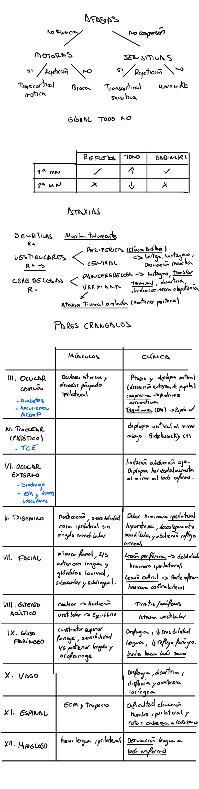
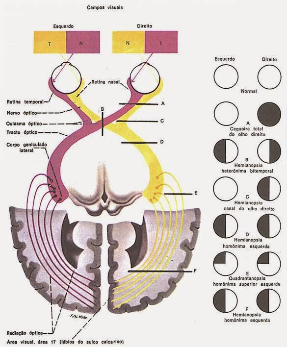
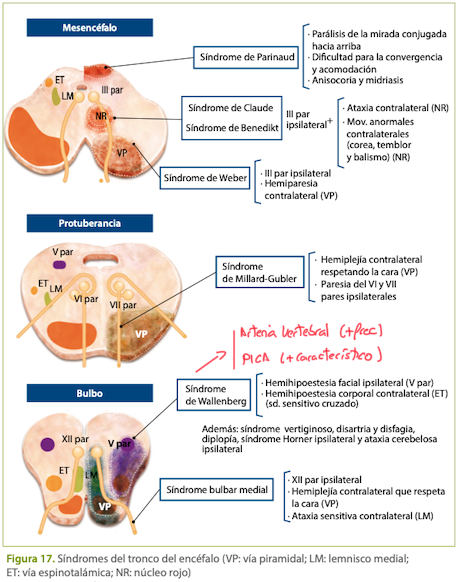
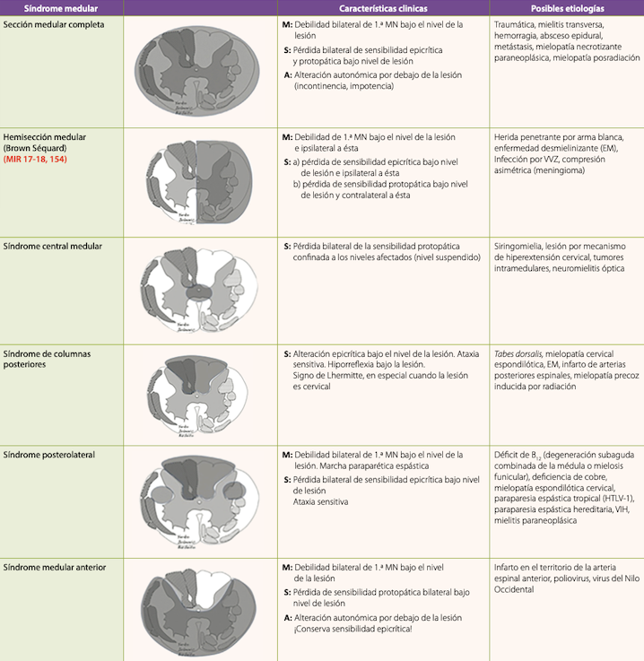

# Fisiología en Neurología

>Los pares craneales nos dan el nivel de la lesión. No hay que olvidar la regla 2-2-4-4: los dos primeros pares “no llegan al tronco”, el III y el IV llegan al mesencéfalo; los pares V, VI, VII y VIII a la protuberancia, y los cuatro últimos al bulbo.
>La excepción a esta regla es el V par, recuerda que presenta núcleos en mesencéfalo, protuberancia y bulbo, si bien, el núcleo motor principal del trigémino está en la protuberancia.

#### OTRAS MULTINEURITIS CRANEALES
- Punta del peñasco (Gradenigio): V y VI.
- Ángulo pontocerebeloso: V, VII, VIII y a veces IX.
- Ángulo rasgado posterior (Vernet): IX, X y XI.
- Espacio retrocondíleo (S. Collet-Sicart): IX, X, XI y XII.
- Espacio retroparotídeo (Villaret): IX, X, XI y XII.

## ALTERACIONES CAMPIMÉTRICAS

- Las radiaciones ópticas inferiores (temporales) producen una cuadrantanopsia homónima contralateral de predominio superior. Tumores Hipofisarios.
- Las radiaciones ópticas superiores (parietales) producen una cuadrantanopsia homónima contralateral de predominio inferior. Craneofaringiomas.

## Síndromes Troncoencefálicos

## Síndromes Medulares

***Tags:***
#neurologia #introduccion #fisiologia #CTO #MIR
